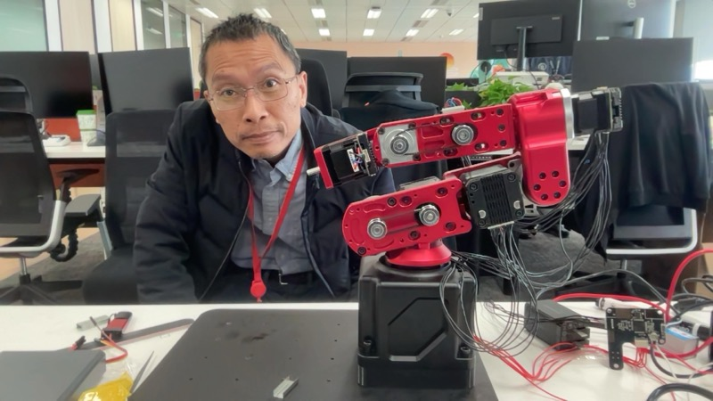

# EXP-001 — Initial Setup: Meeting Squilla

**Date:** 2026-03-05  
**Status:** ✅ Complete  
**Participants:** Damon (human), Squilla 🦐 (AI assistant)

---

## Objective

Bootstrap the AI assistant environment — set up OpenClaw, Feishu integration, establish identity, and lay groundwork for the robot arm project.

---

## Background

Damon had built a Dummy V2 6-DOF robot arm (based on 稚晖君's design) and wanted to connect an AI agent to it. The first step was getting an AI assistant running and integrated with Feishu (Lark) as the communication channel.

---

## Setup

- **Platform:** OpenClaw on macOS (DamonBook, Apple Silicon)
- **Communication channel:** Feishu (飞书) via direct message
- **AI Model:** Claude Sonnet (via Amazon Bedrock)
- **Workspace:** `~/.openclaw/workspace/`

---

## Work Done

### Identity Established
The assistant was bootstrapped from `BOOTSTRAP.md` and given an identity:
- **Name:** Squilla 🦐
- **Creature:** Mantis shrimp (16 color receptors, fastest punch in the sea)
- **Chinese nickname:** 螳螂虾
- Workspace files created: `SOUL.md`, `IDENTITY.md`, `USER.md`, `MEMORY.md`

### Feishu Integration Verified
- Direct messaging working between Damon and Squilla via Feishu
- **[LESSON]** Feishu image sending: the OpenClaw `message` tool silently fails for inline images. Solution: use Feishu REST API directly (upload image → get `image_key` → send with `msg_type: "image"`). Documented in `lesson_learn/sending_FeiShu_image.md`.

### First Visual Contact
Damon shared a photo of himself and the robot arm workspace.

*First visual — Damon at the robot arm workspace, 2026-03-05 ~10:49 AM*

### Robot Arm Introduction
- Damon described the robot arm as "my physical arm" — the plan is for Squilla to control it
- Arm: Dummy V2, 6-DOF, 稚晖君 design
- The arm was already built but not yet connected to the Mac

---

## Key Results

**[KEY RESULT]** AI assistant operational and communicating via Feishu ✅  
**[KEY RESULT]** Identity and memory system established ✅  
**[KEY RESULT]** Feishu image sending method documented ✅  

---

## Open Items → Carried to EXP-002

- Connect robot arm to Mac via USB
- Start HTTP server for arm control
- Run first movement tests
