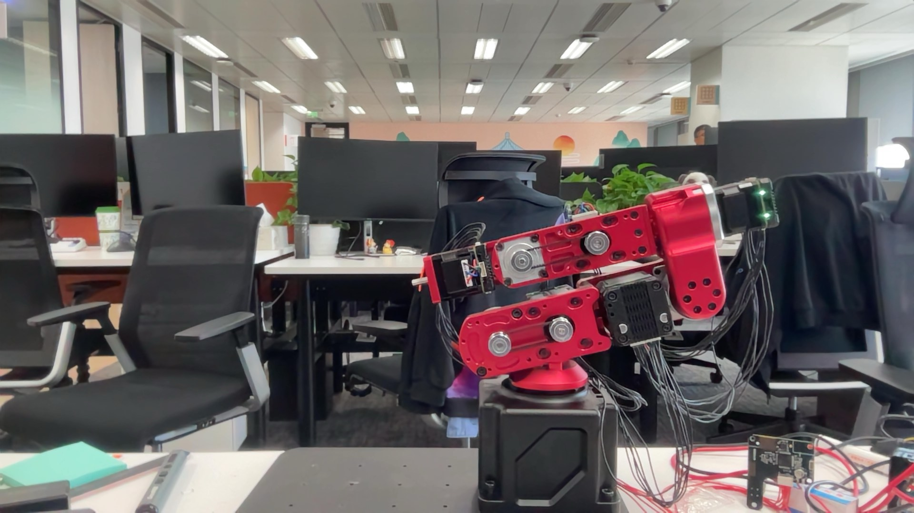
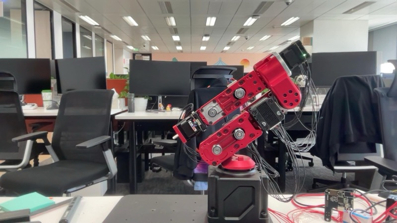
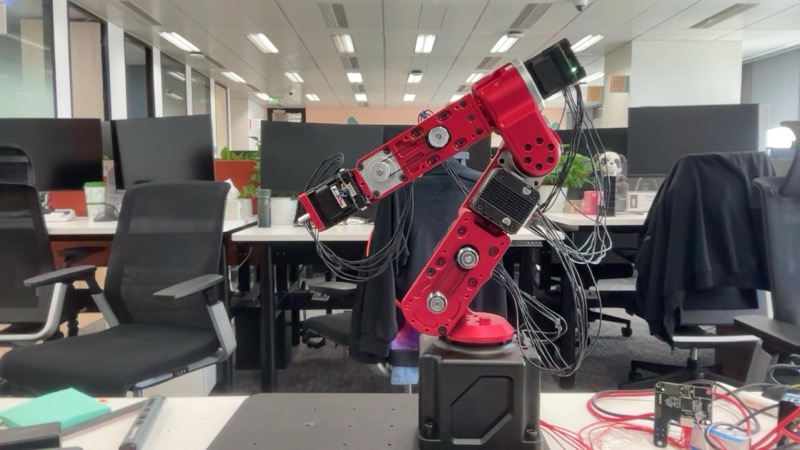
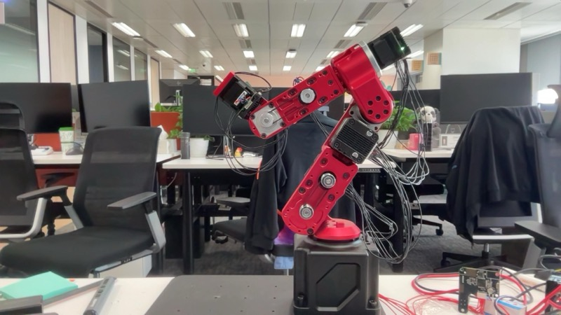
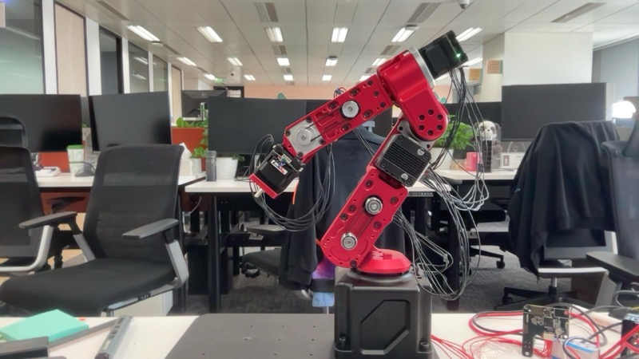

# EXP-002 — First Connection: Robot Arm Online

**Date:** 2026-03-06  
**Status:** ✅ Complete  
**Participants:** Damon (human), Squilla 🦐 (AI assistant)

---

## Objective

Connect the Dummy V2 robot arm to the Mac via USB, start the HTTP control server, verify the full control stack, and run first movement commands.

---

## Background

The robot arm (Dummy V2, 6-DOF) had been built and calibrated in a previous session (EXP-001 context). Key calibration facts going in:
- All `inverseDirection` flags corrected for this hardware (J1=true, J2-J6 differ from reference)
- Reduction ratios fixed (all 50:1, J4=40 due to belt coupling)
- `homing()` and `resting()` confirmed working
- Home offset set via `apply_home_offset()` at REST pose

Damon reported the bug was fixed and the arm was connected via USB.

---

## Hardware & Software

| Component | Detail |
|-----------|--------|
| Robot | Dummy V2, 6-DOF, red anodized aluminum |
| Connection | USB (device: `/dev/cu.usbmodem2083327A4D4B1`) |
| USB VID:PID | `1209:0D32` (Fibre protocol, native interface) |
| Control server | FastAPI + uvicorn, `robot_server.py` |
| Server URL | `http://127.0.0.1:3001` |
| Python libs added | `pyserial`, `pyusb`, `libusb` (via brew) |

---

## Work Done

### Phase 1: Repository Exploration

Cloned repo at `~/Desktop/workspace/aidummy/`. Studied `learning_docs/` written by a previous coding agent:
- `for_agents_using_this_robot_arm.md` — main API reference
- `python_commands.md` — full command reference  
- `calibration_troubleshooting.md` — deep dive into calibration history
- `joint_direction_verification.md` — joint direction analysis

### Phase 2: HTTP Server Launch Attempts

First attempt to start `robot_server.py` failed — `fibre.find_any("usb")` threw:
```
Exception: Invalid path spec "usb"
```
**[LESSON]** The `usbbulk_transport` requires `pyusb` which wasn't installed. Only TCP/UDP transports were available by default.

Installed `pyusb` + `libusb`. USB device found (`1209:0D32`). New error:
```
Exception: packet too short
```

### Phase 3: USB Protocol Debugging

**Root cause analysis:**

1. **USB Reset bug** — `usbbulk_transport.py` calls `self.dev.reset()` on non-Windows. On macOS, this permanently disconnects STM32 USB CDC devices instead of re-enumerating. The arm disappeared from USB entirely after the first connection attempt.

   **[FIX]** Patched `usbbulk_transport.py` to skip reset on macOS (Darwin).

2. **Short packet crash** — The receiver thread in `protocol.py` raised `Exception("packet too short")` on any 0-1 byte packet (e.g. USB ZLPs during init), which marked the channel as broken.

   **[FIX]** Patched `protocol.py` to silently skip packets < 2 bytes instead of crashing.

3. **Connection timeout** — Server used `find_any("usb", timeout=10)`. The full Fibre JSON enumeration over USB takes longer than 10s.

   **[FIX]** Increased timeout to 90 seconds.

4. **`robot.enabled` not a readable property** — `GET /robot/info` crashed because `d.robot.enabled` doesn't exist as a readable attribute on the real device.

   **[FIX]** Updated `get_info` and `get_status` endpoints to handle real vs sim device differences.

### Phase 4: Successful Connection

**[KEY RESULT]** HTTP server connected to robot arm ✅

```json
{
  "mode": "physical",
  "serial_number": "35747859680587",
  "temperature": 50.0,
  "voltage": 3.36,
  "status": "connected"
}
```

All 6 joints reading ~0° (correct — REST pose after calibration).


*Robot arm at REST pose, HTTP server online*

### Phase 5: First Movement Commands

**Working mode system established:**
- 🏗️ Building Mode (default): detailed, explanatory
- 🏃 Running Mode: fast execution, action + photo only
- Trigger: Chinese message starting with 螳螂虾 → auto Running Mode

**Movement sequence:**

#### Move 1 — Raise lower arm (J2: -73° → -50°)
`POST /robot/move_j {"j1":0, "j2":-50, "j3":180, "j4":0, "j5":0, "j6":0}`



#### Move 2 — Raise forearm (J3: 180° → 155°)
`POST /robot/move_j {"j1":0, "j2":-30, "j3":155, "j4":0, "j5":0, "j6":0}`



#### Move 3 — Point hand up (J5: 0° → -70°)
`POST /robot/move_j {"j1":0, "j2":-30, "j3":155, "j4":0, "j5":-70, "j6":0}`



#### Move 4 — Point hand down (J5: -70° → +70°)
`POST /robot/move_j {"j1":0, "j2":-30, "j3":155, "j4":0, "j5":70, "j6":0}`



---

## Key Results

**[KEY RESULT]** All USB protocol bugs identified and patched ✅  
**[KEY RESULT]** HTTP server running and stable at `http://127.0.0.1:3001` ✅  
**[KEY RESULT]** Full movement control verified (J2, J3, J5 tested) ✅  
**[KEY RESULT]** Camera feedback loop working (photo after each action) ✅  
**[KEY RESULT]** Building/Running mode system operational ✅  

---

## Patches Applied (for reproducibility)

**`3.Software/CLI-Tool/fibre/usbbulk_transport.py`**
```python
# Before:
if platform.system() != 'Windows':
    self.dev.reset()

# After: skip reset on macOS to prevent permanent USB disconnect
if platform.system() == 'Windows':
    pass
```

**`3.Software/CLI-Tool/fibre/protocol.py`**
```python
# Added before process_packet() call in receiver thread:
if len(response) < 2:
    continue  # skip USB ZLPs / spurious short packets
```

---

## Open Items

- [ ] Investigate why `get_voltage()` returns 3.36V (should be ~24V — possibly a different sensor)
- [ ] Fix `calibrate_home_offset()` (known issue: 0.5A too low for 50:1 gearboxes)
- [ ] Fix REF board power button malfunction (always on)
- [ ] Test full `homing()` and `resting()` sequences
- [ ] Explore Cartesian control via `move_l()`
